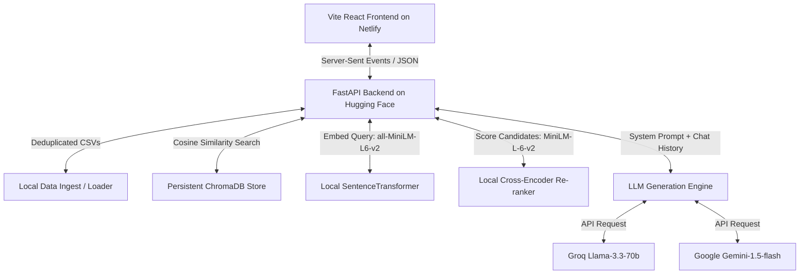

# 🍿 CineQuery AI (सिनिma AI)

CineQuery AI is an immersive, conversational **Retrieval-Augmented Generation (RAG) assistant** designed specifically for cinema. It allows users to search, explore, and ask complex natural language questions about a dataset of **40,000+ movies, plots, directors, cast members, and trivia**. 

The app features a **Vite + React frontend** with a beautiful, responsive, and immersive cinematic theme, and a **FastAPI backend** utilizing local sentence embeddings, vector search, semantic re-ranking, and advanced LLM generation.

🔗 **Live Application URL**: [https://cinequer.netlify.app/](https://cinequer.netlify.app/)

---

## 🏛️ System Architecture

CineQuery AI employs a modular and resource-efficient architecture combining local machine learning models for vector database search with high-performance cloud LLMs for natural language generation.



### ⚡ The RAG Pipeline Workflow
1. **Query Input**: The user sends a natural language question (e.g. *"Find me suspenseful space thrillers with a lonely astronaut"*).
2. **Local Embedding**: The backend embeds the query using a local **SentenceTransformer (`all-MiniLM-L6-v2`)** model into a 384-dimensional dense vector.
3. **ChromaDB Vector Retrieval**: ChromaDB performs a cosine similarity search over the 40,869 indexed movie plot segments, returning the top 12 candidate chunks.
4. **Local Re-ranking**: A local **Cross-Encoder (`cross-encoder/ms-marco-MiniLM-L-6-v2`)** evaluates the query against each candidate chunk, outputting precise relevance scores to combat semantic drift and retrieve the top 3 most relevant segments.
5. **Confidence Score Calculation**: An average cosine similarity is calculated across the top-3 chunks to act as a database confidence metric.
6. **LLM Generation & Character Streaming**: The top 3 chunks, context window conversation history, and user's query are formatted and sent to the LLM (Groq or Gemini) via an asynchronous stream. Tokens are streamed back to the frontend in real time using **Server-Sent Events (SSE)**.

---

## 🛠️ Technology Stack & Tools Used

### Frontend
- **React 19 & Vite**: Ultra-fast build tool and rendering engine.
- **Lucide React**: Clean, modern iconography.
- **CSS**: Custom vanilla stylesheet with cinematic design systems, projector beams, floating movie elements, and glassmorphism.

### Backend
- **FastAPI & Uvicorn**: High-performance asynchronous Python web framework and web server.
- **ChromaDB**: Native open-source vector database configured with HNSW cosine-similarity space.
- **Sentence-Transformers (PyTorch)**: Powering local 384d sentence embeddings and hybrid Cross-Encoder re-ranking.
- **SSE-Starlette**: Server-Sent Events implementation for fast, streamed chat replies.
- **LangChain & Python-Dotenv**: Configuration and API integrations.
- **Groq SDK & Google GenAI SDK**: Integrations for cloud LLMs.

---

## 📁 Repository Structure

```
CineQuery AI/
├── backend/                   # FastAPI Python Service
│   ├── ingestion/             # CSV processing, chunking & DB indexing scripts
│   ├── prompts/               # System and User templates (cinema geek persona)
│   ├── routers/               # Chat stream and admin ingest API endpoints
│   ├── services/              # Embedder, retriever, re-ranker, memory, and generator
│   ├── main.py                # FastAPI app entry point & DB startup downloader
│   └── requirements.txt       # Backend package dependencies
├── datasets/                  # Movie datasets, casts, crews, and wiki plots (CSV/Excel)
├── frontend/                  # Vite + React Client App
│   ├── src/
│   │   ├── components/        # ChatWindow, CitationCard, MessageBubble UI elements
│   │   ├── hooks/             # Custom useStream hook for Server-Sent Events
│   │   ├── App.jsx            # Main app component
│   │   └── App.css / index.css# Cinema design styling & animations
│   ├── package.json           # Frontend script config and libraries
│   └── vite.config.js         # Build tooling presets
├── Dockerfile                 # Multi-stage production container configuration
└── DEPLOYMENT.md              # In-depth production deployment walkthrough
```

---

## ⚙️ Local Development Setup

### 1. Prerequisites
- Python 3.10+
- Node.js 18+
- Groq API Key or Google Gemini API Key

### 2. Environment Configuration
Create a `.env` file in the root directory:
```env
LLM_PROVIDER=groq          # Set to 'groq' or 'gemini'
GROQ_API_KEY=your_key_here
GEMINI_API_KEY=your_key_here
CONFIDENCE_THRESHOLD=0.45
CHROMA_STORE_DIR=./chroma_store
KNOWLEDGE_BASE_DIR=./knowledge_base
```

### 3. Running the Backend
```bash
# Setup Python virtual environment
python -m venv .venv
source .venv/bin/activate   # On Windows: .venv\Scripts\activate

# Install dependencies
pip install -r backend/requirements.txt

# Start local server (listening on port 8000)
python -m uvicorn backend.main:app --host 0.0.0.0 --port 8000 --reload
```

### 4. Running the Frontend
In a new terminal window:
```bash
cd frontend
npm install
npm run dev
```
Open `http://localhost:5173` in your browser.

---

## 💾 Database Ingestion & Persistence

The backend features a dual-ingestion capability:
- **CLI/API Ingestion**: Run the loader script to parse the `datasets` folder, merge movie records with cast and crew metadata, split plots into overlapping chunks, embed them, and index them in Chroma:
  ```bash
  python -m backend.ingestion.loader
  ```
- **Automated Pre-built DB Downloader**: During cloud startup, if the environment variable `CHROMA_DB_URL` is set, the application automatically downloads, extracts, and resolves redirects for a zipped, pre-ingested `chroma_store` database (hosted publicly on Dropbox/Google Drive), enabling immediate database readiness on server start without intensive memory/CPU operations.

---

## 🚀 Deployment

The project is structured to deploy smoothly in production.

### Backend (Docker on Hugging Face Spaces)
The backend container is built and run directly using the root [Dockerfile](file:///E:/Projects/CineQuery%20AI/Dockerfile):
- Exposes port `7860` (Hugging Face default).
- Downloads embedding and re-ranking models locally into memory.
- Uses `CHROMA_DB_URL` to pull the pre-built vector index automatically on launch.

### Frontend (Static CDN on Netlify)
The React application is deployed to **Netlify**:
- Connected to the repository.
- Root directory config: `frontend`
- Build command: `npm run build`
- Publish directory: `dist`
- Environment variables: `VITE_BACKEND_URL` is pointed to the live FastAPI URL.
- Live public URL: [https://cinequer.netlify.app/](https://cinequer.netlify.app/)

